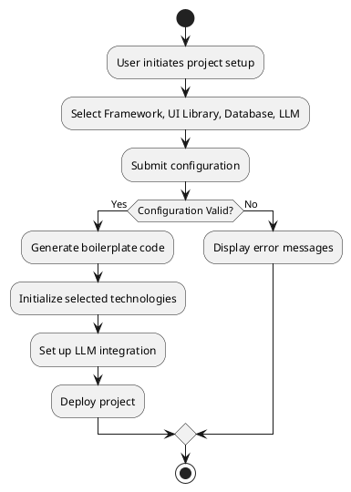
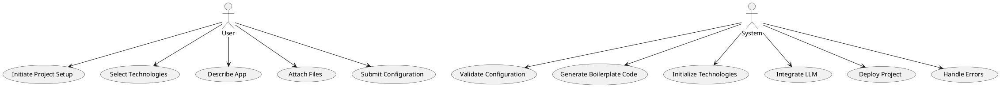

# Codebase Analysis Report

## Overview

The current project is an AI-powered text-to-code generation application built with React. It leverages a single Large Language Model (LLM) to facilitate code generation based on user prompts. The application is structured into multiple components, each responsible for distinct functionalities such as the workbench interface, code editor integration, chat interface, UI components, and server-side operations. The project emphasizes modularity, performance optimization through memoization, and the use of modern libraries and frameworks like Framer Motion, Radix UI, and CodeMirror.

## Summary of Context Files

Refer to the [`context_files_found.md`](./context_files_found.md) file for a comprehensive list of all discovered `.context.md` files. These files provide detailed descriptions of the components and modules within each directory, outlining their responsibilities, structure, and development conventions.

### Key Insights

1. **Modular Architecture**: The project is divided into well-defined modules such as `workbench`, `editor`, `chat`, `ui`, `hooks`, `webcontainer`, `header`, `sidebar`, and `routes`. This separation of concerns facilitates maintainability and scalability.

2. **Current Limitations**:
   - **Single Framework and LLM**: The application currently supports React as the primary framework and relies on a single LLM. This limits flexibility in project initialization and customization.
   - **Hardcoded Component Selection**: UI libraries and components are pre-selected, restricting user choice during project setup.
   - **Limited Database Support**: Database options are predefined with limited flexibility for user selection.

3. **Reusable Components**:
   - **UI Components**: Components like `IconButton`, `LoadingDots`, and `ThemeSwitch` are designed for reusability across different parts of the application.
   - **Custom Hooks**: Hooks such as `useMessageParser`, `usePromptEnhancer`, and `useShortcuts` encapsulate reusable logic, promoting code reuse and cleaner component structures.

4. **Server-Side Operations**: The server-side code handles critical functionalities like component selection, LLM interactions, and runtime operations, indicating a robust backend integration.

5. **Styling Conventions**: The use of SCSS with BEM methodology and CSS variables ensures consistent theming and responsive design across components.

### Potential Challenges

- **Integration Complexity**: Introducing multiple frameworks, UI libraries, databases, and LLMs will increase the complexity of the project, requiring careful architectural planning.
- **Compatibility Issues**: Ensuring compatibility between different libraries and frameworks may lead to dependency conflicts or require additional abstraction layers.
- **Performance Overheads**: Managing multiple adapters and abstraction layers could introduce performance bottlenecks if not optimized properly.
- **State Management**: Handling diverse state requirements across different technologies will necessitate a robust state management strategy.

### Recommendations

1. **Adopt a Plugin-Based Architecture**: Implement a plugin system to manage different frameworks, UI libraries, databases, and LLMs. This approach enhances flexibility and scalability, allowing easy addition or removal of technologies.

2. **Utilize Dependency Injection**: Employ dependency injection to manage dependencies between different modules and adapters. This will decouple components and facilitate testing and maintenance.

3. **Abstract Common Functionalities**: Create abstract layers for common functionalities such as configuration management, UI rendering, and database interactions to minimize code duplication and simplify integration.

4. **Enhance Configuration Management**: Develop a centralized configuration system that allows users to select their preferred technologies during project initialization. Persist these settings using a reliable state management solution.

5. **Implement Comprehensive Error Handling**: Develop robust error handling and validation mechanisms to manage compatibility issues and ensure seamless user experiences.

6. **Optimize Performance**: Leverage memoization and code-splitting techniques to maintain optimal performance despite the increased complexity.

### Identification of Reusable Components

- **UI Component Library**: Components like `IconButton`, `LoadingDots`, and `ThemeSwitch` can be adapted to work with different UI libraries by abstracting their styling and behavior.
- **Custom Hooks**: Hooks such as `useMessageParser` and `usePromptEnhancer` can be extended to support additional functionalities required by new frameworks or databases.
- **Adapter Modules**: Existing server-side adapters for LLMs and databases can be expanded to accommodate new options, ensuring consistent integration across different technologies.

## UML Diagrams

### 1. Data Model Diagram

```
plantuml
@startuml
entity "User Settings" {
  * id : UUID
  * framework : String
  * uiLibrary : String
  * database : String
  * llmModel : String
}

entity "Project" {
  * id : UUID
  * name : String
  * description : String
  * settingsId : UUID
}

entity "Component" {
  * id : UUID
  * name : String
  * description : String
  * library : String
}

User_Settings ||..|| Project : "has"
Project ||--o{ Component : "includes"
@enduml
```

**Explanation**: This diagram illustrates the relationship between user settings, projects, and components. Each project has associated settings, and projects include various components from selected UI libraries.

### 2. Activity Diagram



**Explanation**: This diagram outlines the workflow of project initialization, from user input to configuration validation, code generation, technology setup, and deployment.

### 3. State Machine Diagram

```plantuml
@startuml
[*] --> Idle

Idle --> Configuring : Start Setup
Configuring --> Validating : Submit Configuration
Validating --> Generating Code : Valid Configuration
Validating --> Configuring : Invalid Configuration
Generating Code --> Initializing Technologies : Code Generated
Initializing Technologies --> Deploying : Technologies Initialized
Deploying --> [*] : Project Deployed
Deploying --> Error State : Deployment Failed

Error State --> [*]
@enduml
```

**Explanation**: This diagram depicts the various states during the project initialization process, including handling errors during deployment.

### 4. Use Case Diagram



**Explanation**: This diagram illustrates the interactions between the user and the system during the project setup and initialization phases.

### 5. Ecosystem Diagram

```plantuml
@startuml
package "Frontend" {
  [React] 
  [Next.js] 
  [Vue] 
  [HTMX]
  [Python]
}

package "UI Libraries" {
  [Shadcn-ui]
  [NextUI]
  [FlowBite]
}

package "Databases" {
  [Supabase]
  [MongoDB]
  [MySQL]
  [SQLite]
  [Firebase]
}

package "LLMs" {
  [OpenAI]
  [Anthropic]
}

package "Core Application" {
  [Project Settings Interface]
  [Code Generation Engines]
  [Configuration Management]
}

User --> [Project Settings Interface]
[Project Settings Interface] --> [Code Generation Engines]
[Code Generation Engines] --> Frontend
[Code Generation Engines] --> UI Libraries
[Code Generation Engines] --> Databases
[Code Generation Engines] --> LLMs
[Core Application] --> Frontend
[Core Application] --> UI Libraries
[Core Application] --> Databases
[Core Application] --> LLMs
@enduml
```

**Explanation**: This diagram showcases the interaction between various components and technologies within the application ecosystem, highlighting how the frontend, UI libraries, databases, and LLMs integrate with the core application functionalities.

## Implementation Guidelines

Based on the analysis, the following steps are recommended to extend the codebase to support the specified technology stack:

### 1. Develop a Configuration Management System

- **Create Configuration Models**: Define TypeScript interfaces for storing user-selected configurations, including framework, UI library, database, and LLM.
- **Persist Configurations**: Implement persistence using context providers or a state management library like Nano Stores to ensure configurations are accessible across the application.
- **UI Integration**: Develop a user interface with dropdown menus for selecting technologies, adhering to the specified UI design guidelines.

### 2. Implement Project Settings Interface

- **UI Components**:
  - **Dropdown Menus**: Create reusable dropdown components with icons representing each category (Framework, UI Library, Database, LLM).
  - **Text Area**: Implement a large text area for users to describe their app, with buttons for attaching files and submitting the description.
- **Design Specifications**: Ensure a clean, minimalist design with a white background and intuitive layout. Utilize responsive design for accessibility across devices.

### 3. Create Code Generation Adapters

- **Framework Adapters**: Develop modules to generate boilerplate code for each supported framework (React, Next.js, Vue, etc.).
- **UI Library Adapters**: Implement adapters that translate component selections into the appropriate syntax and structure for each UI library.
- **Database Adapters**: Create modules to initialize and configure connections to the selected databases.
- **LLM Adapters**: Develop abstraction layers to handle interactions with different LLM providers, ensuring seamless integration based on user selections.

### 4. Integrate Multiple LLM Providers

- **Abstraction Layer**: Design an abstraction layer that generalizes interactions with OpenAI and Anthropic APIs, allowing easy switching between different models.
- **Secure API Key Management**: Implement secure storage and retrieval of API keys, possibly using environment variables and server-side configurations.
- **Model Selection**: Allow dynamic selection of LLM models based on user configuration, ensuring compatibility and efficient utilization of resources.

### 5. Refactor Existing Components

- **Modularization**: Ensure existing components are decoupled and can interact with the new configuration system without significant rewrites.
- **Reusability**: Identify and abstract reusable logic to support multiple technologies, facilitating easier maintenance and expansion.
- **Performance Optimization**: Continue utilizing memoization and other performance enhancements to maintain responsiveness despite increased complexity.

### 6. Update Documentation and Context Files

- **.context.md Files**: Update existing `.context.md` files to reflect new functionalities and components. Create new context files for any newly introduced modules or components.
- **User Documentation**: Provide clear instructions and tooltips within the user interface to guide users through the configuration and project initialization process.
- **Developer Documentation**: Maintain comprehensive documentation for developers to understand the new architecture, integration points, and extension points.

### 7. Implement Robust Testing

- **Unit Tests**: Develop unit tests for new modules and adapters to ensure correctness and reliability.
- **Integration Tests**: Update existing integration tests to cover new configurations and technology integrations.
- **Continuous Integration**: Incorporate automated testing within the CI pipeline to catch regressions and maintain code quality.

### 8. Address Potential Risks

- **Dependency Conflicts**: Carefully manage and version dependencies to prevent conflicts between different technology stacks.
- **Scalability**: Design the system to handle an increasing number of configurations and integrations without degrading performance.
- **Security**: Ensure secure handling of API keys and sensitive configurations, preventing unauthorized access and potential vulnerabilities.

## Summary of Findings and Proposed Next Steps

The current codebase demonstrates a solid foundation with a modular architecture and the use of modern technologies. However, to achieve the objective of flexible project initialization with multiple technology options, significant enhancements are required in the configuration management, code generation adapters, and UI components. Addressing these areas will facilitate a more versatile and scalable application, accommodating a broader range of user preferences and project requirements.

**Next Steps**:

1. **Implement the Configuration Management System**: Begin by developing the models and persistence mechanisms to store user configurations.
2. **Design and Develop the Project Settings Interface**: Create the user interface components that allow users to select their desired technologies.
3. **Develop Code Generation Adapters**: Start building the necessary adapters for frameworks, UI libraries, databases, and LLMs.
4. **Integrate Additional LLM Providers**: Expand the abstraction layer to support multiple LLMs, ensuring seamless switching based on user selections.
5. **Refactor and Optimize Existing Components**: Adjust current components to work harmoniously with the new configurations and adapters.
6. **Update Documentation and Testing Suites**: Ensure all changes are well-documented and thoroughly tested to maintain code quality and reliability.

By following these guidelines, the application will achieve enhanced flexibility and scalability, providing users with a more personalized and efficient code generation experience.
